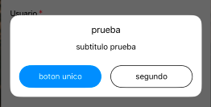

# DHLModalHelper
Helper para modales custom para swiftUI


## Preview


## Installation

### CocoaPods

```ruby
pod 'DHLModalHelper'
```

## Quick Start

### SwiftUI

SetUp:

```swift
DHLModalHelper.shared.setUp(titleFont: FontsHelper.customFont(.big), subtitleFont: FontsHelper.customFont(.normal), buttonsFont: FontsHelper.customFont(.small), buttonsColor: Color.primaryColorApp)
```

Show alert:

```swift
@State private var showCustomModal = false

.showAlert(
    showForgotPasswordModal,
    title: "title",
    subtitle: "subtitle",
    firstButtonText: "first",
    firstButtonAction: {
        showCustomModal = false
      },
    secondButtonText: "second",
    reverseSecondButtonColor: true,
    secondButtonAction: {
        showCustomModal = false
    }
)
```
